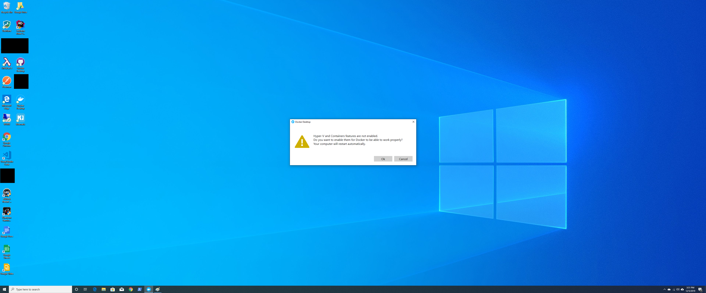
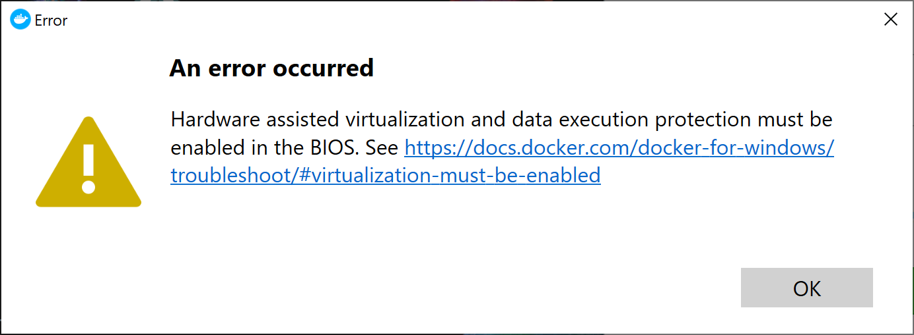
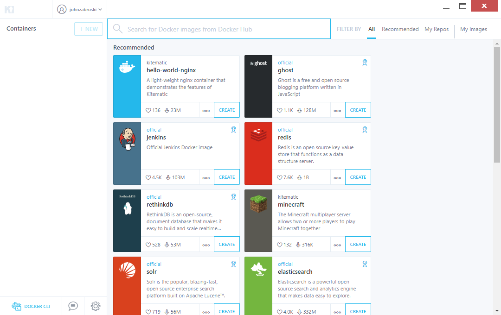

# Practical Uses For Docker
For Docker talk at NEMD December 2019

# Disclaimers

SSRS is defintely not supported in containers.  BUT!  It is pretty useful for your lower level test environments that you might have previously deployed on a single machine to save on licensing costs and reduce IT footprint / machines that need patching and security updates!

# Getting Started Installing Docker on Windows

We'll be using PowerShell Core, Docker Desktop and Docker Kinematic.

These tools take time to install, as does pulling down your first docker images.

## Pre-requisites

Docker Desktop requires **Windows 10 Pro**.
If you try to install Docker Desktop on Windows 10 Home, it will fail.
This demo requires **SQL Server 2017**.

Note: If you don't have Windows 10 Pro, you can still use Docker via **Docker Toolbox** instead, or using a virtual machine like VirtualBox which provides virtualization hooks for Docker.

## Install Chocolatey, PowerShell Core, Docker Desktop and Docker Kinematic

1. Open PowerShell Classic, using Run As Administrator, and run the following command:
    ```powershell
    Set-ExecutionPolicy Bypass -Scope Process -Force; iex ((New-Object System.Net.WebClient).DownloadString('https://chocolatey.org/install.ps1'))
    ```

2. Close the PowerShell Classic window.
3. Open a new PowerShell Classic window, using Run As Administrator, and run the following command:
    ```powershell
    choco install powershell-core -y
    ```
4. Close PowerShell Classic window.
5. Open PowerShell Core window, using Run As Administrator, and run the following commands:
    ```powershell
    choco install docker-desktop -y
    choco install docker-kitematic -y
    ```

6. After these install, you have to log out of Windows and log back in, so that your user account's `docker-users` group membership takes effect.
    1. If you don't log out and log back in, upon trying to start **Docker Desktop**, you'll get an event toaster error telling you "Docker Desktop - Requires Log out" and explaining that it is so your docker-users membership can take effect. 

7. After logging back in, in the Windows "Type here to search" box, search for **Docker Desktop**.
    1. As Docker starts, you'll see an event toaster in the bottom right saying docker might take a few moments to start.
    2. As its starting, it will detect you do not have Hyper-V and Container features enabled.
    3. Click OK and it will restart your computer.
    

    
8. After your computer restarts, log back in.  In the Windows "Type here to search box", search for **Docker Desktop**.
    1. _Uhh..._ you might get the following error if you haven't enabled virtualization in your BIOS.
    

9. Open Windows PowerShell Core and run the following command, which will benchmark how long it takes to pull down the image:
    ```powershell
    Measure-Command { docker pull randreng/ssrs | Out-Default }
    ```
    **This command will fail the first time you run it.  The failure message is not in red blood, so read carefully!**
    
    1. The error message is "_image operating system "windows" cannot be used on this platform_"
        1. This error message is easy to fix.  The default Docker Desktop is configured to run Linux Containers.
        2. Go to your System Tray, find the little tiny Moby whale, right click, select "Switch to Windows containers"
            1. For command line lovers, run:
                ```powershell
                & $Env:ProgramFiles\Docker\Docker\DockerCli.exe -SwitchDaemon
                ```
                As of this writing, running this twice will revert the switch.  May change in the future if there are more OS container sub-systems supported!
    2. Knowing how long it takes to download your base image will help give you a sense of how long to expect it to take to spin up a container from scratch on a new machine.
    3. This download time might _also_ convince you to invest in a local Docker Registry or a Registry co-located with your applications.
    
10. Once your image has been pulled (downloaded) from the docker registry,
    ```powershell
    mkdir c:/ssrs/
    docker run -d -p 1433:1433 -p 80:80 -v C:/ssrs/:C:/sqldata/ -e sa_password=Compl3xPassw0rd -e ssrs_user=SSRSAdmin -e ssrs_password=Compl3xPassw0rd4Ssrs randreng/ssrs --attach
    ```
    This command does a couple of things, which you can look in the [commandline/run](https://docs.docker.com/engine/reference/commandline/run/) documentation:
    1. `-d` : Run container in background and print container ID
    2. `-p 1433:1433` : Publish a container’s port (1433) to the host (1433)
    3. `-p 80:80` : Publish a container's port (80) to the host (80)
    4. `-v C:/ssrs/:C:/sqlData/` : [Bind mount](https://docs.docker.com/engine/reference/commandline/run/#mount-volume--v---read-only) a volume.  In this case, we're mounting C:/ssrs/ to C:/sqlData/
        a. When the host directory of a bind-mounted volume doesn’t exist, Docker will automatically create this directory on the host for you. In the example above, Docker will create the /doesnt/exist folder before starting your container.
        b. On Windows, the paths must be specified using Windows-style semantics.
    5. `-e sa_password=Compl3xPassw0rd` : 	Set environment variable `sa_password` to `Compl3xPassw0rd`.
        a. Note that since this is a SQL Server sa password, your machine's password policy applies.  If the password is not complex enough, you'll (probably) get a warning, although whether that warning is actually surfaced to stdout/stderr depends on who wrote the docker image you're using and how thoughtful they were :)
        b. You can see 
    6. `-e ssrs_user=SSRSAdmin` : Set environment variable `ssrs_user` to `SSRSAdmin`
    7. `-e ssrs_password=Compl3xPassw0rd4Ssrs` : Set environment variable `ssrs_password` to `Compl3xPassw0rd4Ssrs`
    8. `randreng/ssrs` : The image we wish to run.
        a. If it's not already been pulled down, docker will pull it prior to running it.
    9. `--attach` : Attaches the container to stdin, stderr, stdout
        a. Useful for troubleshooting why your container dies within the first seconds or minutes after it starts.
        b. Remember, containers have no memory, so if you don't think through how to monitor them, you won't know why they stop.
        c. **Still can't figure out why your having problems?**
            1. Make sure you're running docker.exe as Administrator in order for it to call CreateProcess
            2. Microsoft Premiere Support created a Troubleshooting PowerShell script for Windows Containers to help you out! https://docs.microsoft.com/en-us/virtualization/windowscontainers/troubleshooting
            3. Check the Windows Event Log under Application events with Source equal to Docker.
            `Get-EventLog -LogName Application -Source Docker -After (Get-Date).AddMinutes(-30) -EntryType Error | Sort-Object Time`
# Docker Basics

Every command in a Dockerfile creates a thing called a _layer_ in your _docker image_.

_Layers_ increase the size of your docker image.

More layers equals larger images equals more storage costs / longer download times.

Advice: Worry about getting it correct before you worry about optimizing for size.

Each command is a _directive_.

Useful directives include:

* `FROM` defines your base image you will build your container from.
* `EXPOSE` to expose a port to the docker hosting service.
* `COPY` to copy scripts to the docker engine (in order to run it).
* `RUN` to run a command
* `ENTRYPOINT` to define the command docker will run when starting the container.
* `HEALTHCHECK` to determine the health of the container ITSELF.  Do not abuse this to check on the health of external services.
* Other directives cover things like metadata about who maintains this image, etc.
* The [Dockerfile file format](https://docs.docker.com/engine/reference/builder/) / language is available online in the documentation.

# Using Kitematic

Kitematic is a graphical approach to managing your docker containers.  If you're allergic to the command line, you might find this tool useful.

_In my limited experience, I found this tool has some rather strange bugs, so I avoid using it, but it's really cool for demoes.  The current release is 0.17.9 (to give you an idea of what the authors think of the stability and robustness of this program)._

1. Go to the Windows "Type here to search" box.  Type "Kitematic" and press enter.
2. The first time you start Kitematic, it will ask you to **Enter your Docker Hub credentials**.
    a. If you don't have Docker Hub credentials, create an account.
    b. If you push images to the Docker Hub, by default it will publish using this account name, so don't pick an embarassing account name!
3. After successfully logging in, you will arrive at the Kitematic Welcome screen
    1. Your containers are listed on the left
    2. In the main view pane, you will see suggested / popular images from the Docker Hub.
    

# Docker Security

Be careful of how you expose your Docker Daemon Admin Port.  Lock it down.  Don't use "helpful tools" that require you to expose your Admin Port unnecessarily if you can avoid it.

Docker Containers are commonly used in CryptoJacking attacks, because the container can run arbitrary untrusted code, such as using `wget` to download cryptomining software.  See this ZDNet article for more information: https://www.zdnet.com/article/this-is-how-docker-can-be-exploited-to-covertly-mine-for-cryptocurrency/  A year later, ZDNet wrote another article about a hacking group exploiting the Admin Port on a docker host: https://www.zdnet.com/google-amp/article/a-hacking-group-is-hijacking-docker-systems-with-exposed-api-endpoints/

See also: [The Dangers of Docker.sock](https://raesene.github.io/blog/2016/03/06/The-Dangers-Of-Docker.sock/) which explains that many tutorials might encourage you to give a child container access to the parent docker container's administrative socket.  A practical exploit created by Ben Hall demonstrates that even if you have [`--read-only`](https://docs.docker.com/engine/reference/commandline/run/#mount-volume--v---read-only) specified on the port, you can still create docker containers.

## Inspect Docker Images Before Running Them!

```powershell
docker inspect phola/ssrs
```

```powershell
docker history phola/ssrs --no-trunc
```

See also the Docker documentation best practice article: [Scan images for vulnerabilities](https://docs.docker.com/ee/dtr/user/manage-images/scan-images-for-vulnerabilities/)

# Recommended Reading

[Practical Docker with Python: Build, Release and Distribute your Python App with Docker](https://www.amazon.com/Practical-Docker-Python-Release-Distribute-ebook/dp/B07FYZFKHQ)

The book says Python, but the first couple of chapters require effectively no Python knowledge.  The code is available here: https://github.com/Apress/practical-docker-with-python

# Recommended "ASP.NET Core with Docker" Examples 

https://github.com/rafaelfgx/DotNetCoreArchitecture
https://github.com/dotnet-architecture/eShopOnContainers - shopping website built by Microsoft as a reference architecture for using a Kubernetes cluster in Azure

# Alternatives To Consider

Paul Stanton started WinDocks to solve precisely problems like these.  He has a Community Edition of his WinDocks platform, and a guide for using [SQL Server Reporting Service (SSRS) Containers for SQL Azure and AWS RDS](https://www.windocks.com/lps/ssrs)

My Notes:

1. Getting a copy of WinDocks Community Edition requires you to fill out some contact information so WinDocks sales representatives can sell you on upgrading.
2. The Installer says it is untrusted from Nirvaha Corporation.  Googling around, Nirvaha seemed to be a trusted company started by ex-Microsoft employees.  I gave it a go on my old personal computer, but not on my company purchased computer.

# Feedback

Thanks to Wil Low for suggesting to consider container versioning best practices, especially to give people guidance on how to use docker containers with teams of 80 people.

Additional feedback was: how to find the right base images to base your container off of? Can it be used to manage Windows hotfixes?

Thanks to Sean Flynn for suggesting use case of hosting legacy win32 GUI applications with per-user configurations in a Windows 10 container.

Thanks to Carlos (from FluentMigrator project) for suggesting we try [Docker-in-Docker (aka dind)](https://hub.docker.com/_/docker) to run all tests concurrently. 
